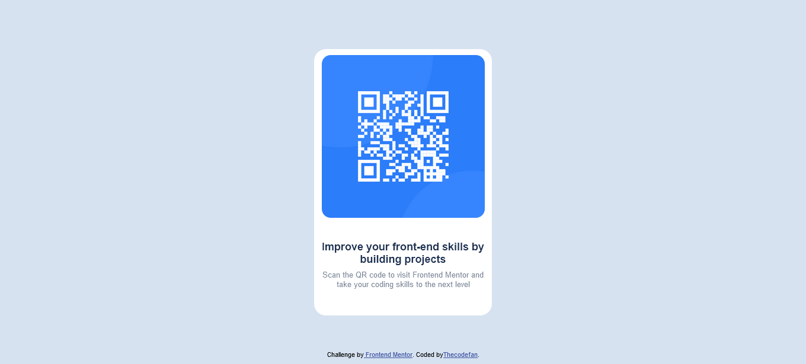

# Frontend Mentor - QR code component solution

This is a solution to the [QR code component challenge on Frontend Mentor](https://www.frontendmentor.io/challenges/qr-code-component-iux_sIO_H). Frontend Mentor challenges help you improve your coding skills by building realistic projects.

## Table of contents

- [Overview](#overview)
  - [Screenshot](#screenshot)
  - [Links](#links)
- [My process](#my-process)
  - [Built with](#built-with)
  - [What I learned](#what-i-learned)
  - [Continued development](#continued-development)
  - [Useful resources](#useful-resources)
- [Author](#author)
- [Acknowledgments](#acknowledgments)

**Note: Delete this note and update the table of contents based on what sections you keep.**

## Overview

### Screenshot

;

### Links

- Live Site URL: [Add live site URL here](https://your-live-site-url.com)

## My process

I tried to design this site using only my eyes to eyeball the design, and then used the style guide provided. First, i created a 2px solid red border and tried to position it in the center to match the design
i kept the border the entire way until the very end, it made the process of positioning easy for me.
I used css flexbox to position the elements to the center, but needed to use positions and top-bottom-left-right to work out the rest.
The text at the bottom felt like it'd fit best, if its container had the width of the imaage and not the entire container, this fix made the text fit much more nicely
I lowered the opacity on the sidetext to match the design provided.
To note: I feel like i used an excess of divs in this design, a more economic use of it will be studied later.

### Built with

- Semantic HTML5 markup
- Flexbox
- CSS Positions
- CSS custom properties

### What I learned

With this lesson, i learnt how to eyeball a design and try to replicate it to the best of my abilities, this design was tested both in mobile and desktop resolutions to ensure that it doesn't break.

Adding a custom font was a new thing for me :

```css
@font-face {
  font-family: "Outfit";
  src: url(https://fonts.google.com/specimen/Outfit);
}
```

### Continued development

I feel like my way of positioning elements in this project was overly complicated, and not very responsive-friendly, even if it was, i used too many lines of code trying to eyeball it.
Better methods and techniques for positioning should be studied at a later date.

## Author

-

## Acknowledgments

-
